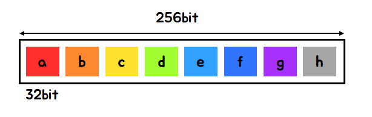

# 문제 24 - Decoder Challenge Solution

## 문제 설명
이 문제는 해시로 암호화된 문자열을 해독하고 규칙에 따라 플래그를 추출하는 웹 해킹 문제입니다. 
제공된 해시를 디코딩하여 원래 문자열을 확인하고, 이를 플래그로 제출해야 합니다.

96719db60d8e3f498c98d94155e1296aac105ck4923290c89eeeb3ba26d3eef92


### 플래그 추출

4dM1n

## 힌트
주어진 문자열 96719db60d8e3f498c98d94155e1296aac105ck4923290c89eeeb3ba26d3eef92 해시값입니다. 이 값이 어떤 해시 알고리즘 SHA-256(64) 등으로 생성된 것인지 식별하고, 이를 크래킹하여 원래의 값을 알아내야 합니다.
해시값의 길이를 기준으로 어떤 알고리즘인지 추정할 수 있습니다:
96719db60d8e3f498c98d94155e1296aac105ck4923290c89eeeb3ba26d3eef92 현재 65자 입니다 


MD5: 32자 (16바이트, 128비트)
SHA-1: 40자 (20바이트, 160비트)
SHA-256: 64자 (32바이트, 256비트)
k 를 지운 해시는 64자 길이를 가지므로, 이는 SHA-256로 생성된 해시일 가능성이 높습니다.


## 사용된 기술
https://md5hashing.net/hash


## 최종 플래그
```
Flag{insecure_storage}
```